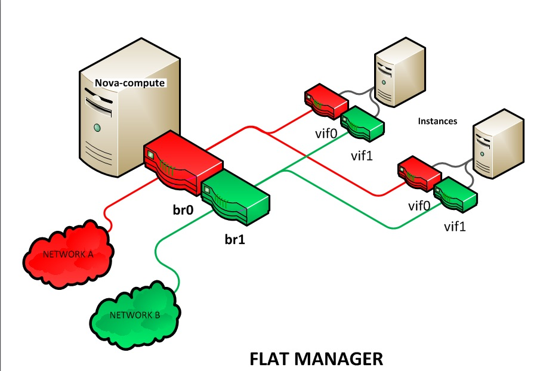
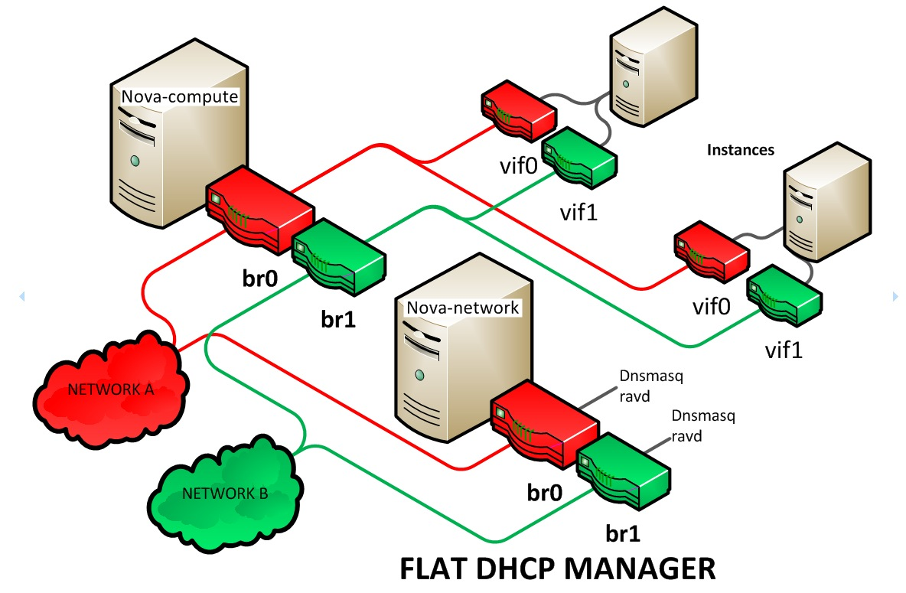
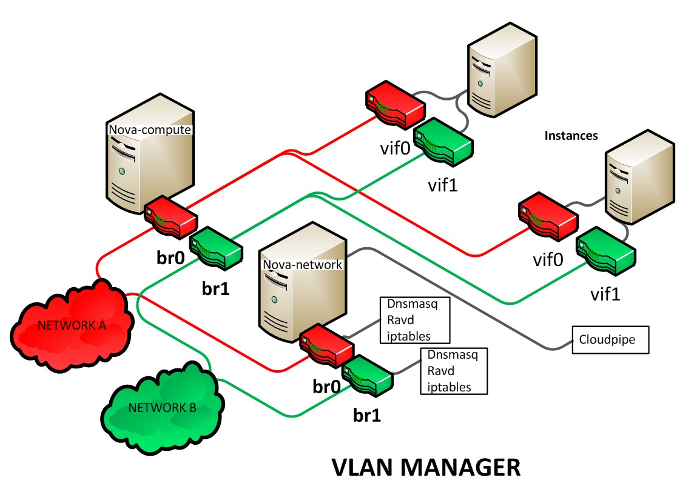

============================
Networking with nova-network
============================

.. deprecated:: 14.0.0

   ``nova-network`` was deprecated in the OpenStack Newton release.  In Ocata
   and future releases, you can start ``nova-network`` only with a cells v1
   configuration. This is not a recommended configuration for deployment.

Understanding the networking configuration options helps you design the best
configuration for your Compute instances.

You can choose to either install and configure ``nova-network`` or use the
OpenStack Networking service (neutron). This section contains a brief overview
of ``nova-network``. For more information about OpenStack Networking, refer to
:neutron-doc:`the documentation <>`.

Networking concepts
~~~~~~~~~~~~~~~~~~~

Compute assigns a private IP address to each VM instance. Compute makes a
distinction between fixed IPs and floating IP. Fixed IPs are IP addresses that
are assigned to an instance on creation and stay the same until the instance is
explicitly terminated. Floating IPs are addresses that can be dynamically
associated with an instance. A floating IP address can be disassociated and
associated with another instance at any time. A user can reserve a floating IP
for their project.

.. note::

   Currently, Compute with ``nova-network`` only supports Linux bridge
   networking that allows virtual interfaces to connect to the outside network
   through the physical interface.

The network controller with ``nova-network`` provides virtual networks to
enable compute servers to interact with each other and with the public network.
Compute with ``nova-network`` supports the following network modes, which are
implemented as Network Manager types:

Flat Network Manager
  In this mode, a network administrator specifies a subnet. IP addresses for VM
  instances are assigned from the subnet, and then injected into the image on
  launch. Each instance receives a fixed IP address from the pool of available
  addresses. A system administrator must create the Linux networking bridge
  (typically named ``br100``, although this is configurable) on the systems
  running the ``nova-network`` service. All instances of the system are
  attached to the same bridge, which is configured manually by the network
  administrator.

.. note::

   Configuration injection currently only works on Linux-style systems that
   keep networking configuration in ``/etc/network/interfaces``.

Flat DHCP Network Manager
  In this mode, OpenStack starts a DHCP server (dnsmasq) to allocate IP
  addresses to VM instances from the specified subnet, in addition to manually
  configuring the networking bridge. IP addresses for VM instances are assigned
  from a subnet specified by the network administrator.

  Like flat mode, all instances are attached to a single bridge on the compute
  node. Additionally, a DHCP server configures instances depending on
  single-/multi-host mode, alongside each ``nova-network``.  In this mode,
  Compute does a bit more configuration. It attempts to bridge into an Ethernet
  device (``flat_interface``, eth0 by default). For every instance, Compute
  allocates a fixed IP address and configures dnsmasq with the MAC ID and IP
  address for the VM.  Dnsmasq does not take part in the IP address allocation
  process, it only hands out IPs according to the mapping done by Compute.
  Instances receive their fixed IPs with the :command:`dhcpdiscover` command.
  These IPs are not assigned to any of the host's network interfaces, only to
  the guest-side interface for the VM.

  In any setup with flat networking, the hosts providing the ``nova-network``
  service are responsible for forwarding traffic from the private network. They
  also run and configure dnsmasq as a DHCP server listening on this bridge,
  usually on IP address 10.0.0.1 (see :ref:`compute-dnsmasq`). Compute can
  determine the NAT entries for each network, although sometimes NAT is not
  used, such as when the network has been configured with all public IPs, or if
  a hardware router is used (which is a high availability option). In this
  case, hosts need to have ``br100`` configured and physically connected to any
  other nodes that are hosting VMs. You must set the ``flat_network_bridge``
  option or create networks with the bridge parameter in order to avoid raising
  an error. Compute nodes have iptables or ebtables entries created for each
  project and instance to protect against MAC ID or IP address spoofing and ARP
  poisoning.

.. note::

   In single-host Flat DHCP mode you will be able to ping VMs through their
   fixed IP from the ``nova-network`` node, but you cannot ping them from the
   compute nodes. This is expected behavior.

VLAN Network Manager
  This is the default mode for OpenStack Compute. In this mode, Compute creates
  a VLAN and bridge for each project. For multiple-machine installations, the
  VLAN Network Mode requires a switch that supports VLAN tagging (IEEE 802.1Q).
  The project gets a range of private IPs that are only accessible from inside
  the VLAN.  In order for a user to access the instances in their project, a
  special VPN instance (code named ``cloudpipe``) needs to be created.  Compute
  generates a certificate and key for the user to access the VPN and starts the
  VPN automatically. It provides a private network segment for each project's
  instances that can be accessed through a dedicated VPN connection from the
  internet. In this mode, each project gets its own VLAN, Linux networking
  bridge, and subnet.

  The subnets are specified by the network administrator, and are assigned
  dynamically to a project when required. A DHCP server is started for each
  VLAN to pass out IP addresses to VM instances from the subnet assigned to the
  project. All instances belonging to one project are bridged into the same
  VLAN for that project. OpenStack Compute creates the Linux networking bridges
  and VLANs when required.

These network managers can co-exist in a cloud system. However, because you
cannot select the type of network for a given project, you cannot configure
multiple network types in a single Compute installation.

All network managers configure the network using network drivers. For example,
the Linux L3 driver (``l3.py`` and ``linux_net.py``), which makes use of
``iptables``, ``route`` and other network management facilities, and the
libvirt `network filtering facilities
<http://libvirt.org/formatnwfilter.html>`__. The driver is not tied to any
particular network manager; all network managers use the same driver. The
driver usually initializes only when the first VM lands on this host node.

All network managers operate in either single-host or multi-host mode.  This
choice greatly influences the network configuration. In single-host mode, a
single ``nova-network`` service provides a default gateway for VMs and hosts a
single DHCP server (dnsmasq). In multi-host mode, each compute node runs its
own ``nova-network`` service. In both cases, all traffic between VMs and the
internet flows through ``nova-network``. Each mode has benefits and drawbacks.

All networking options require network connectivity to be already set up
between OpenStack physical nodes. OpenStack does not configure any physical
network interfaces. All network managers automatically create VM virtual
interfaces. Some network managers can also create network bridges such as
``br100``.

The internal network interface is used for communication with VMs. The
interface should not have an IP address attached to it before OpenStack
installation, it serves only as a fabric where the actual endpoints are VMs and
dnsmasq. Additionally, the internal network interface must be in
``promiscuous`` mode, so that it can receive packets whose target MAC address
is the guest VM, not the host.

All machines must have a public and internal network interface (controlled by
these options: ``public_interface`` for the public interface, and
``flat_interface`` and ``vlan_interface`` for the internal interface with flat
or VLAN managers). This guide refers to the public network as the external
network and the private network as the internal or project network.

For flat and flat DHCP modes, use the :command:`nova network-create` command to
create a network:

.. code-block:: console

   $ nova network-create vmnet \
     --fixed-range-v4 10.0.0.0/16 --fixed-cidr 10.0.20.0/24 --bridge br100

This example uses the following parameters:

``--fixed-range-v4``
  Specifies the network subnet.
``--fixed-cidr``
  Specifies a range of fixed IP addresses to allocate, and can be a subset of
  the ``--fixed-range-v4`` argument.
``--bridge``
  Specifies the bridge device to which this network is connected on every
  compute node.

.. _compute-dnsmasq:

DHCP server: dnsmasq
~~~~~~~~~~~~~~~~~~~~

The Compute service uses `dnsmasq
<http://www.thekelleys.org.uk/dnsmasq/doc.html>`__ as the DHCP server when
using either Flat DHCP Network Manager or VLAN Network Manager. For Compute to
operate in IPv4/IPv6 dual-stack mode, use at least dnsmasq v2.63. The
``nova-network`` service is responsible for starting dnsmasq processes.

The behavior of dnsmasq can be customized by creating a dnsmasq configuration
file. Specify the configuration file using the ``dnsmasq_config_file``
configuration option:

.. code-block:: ini

   dnsmasq_config_file=/etc/dnsmasq-nova.conf

For more information about creating a dnsmasq configuration file, see the
:doc:`/configuration/config`, and `the dnsmasq documentation
<http://www.thekelleys.org.uk/dnsmasq/docs/dnsmasq.conf.example>`__.

Dnsmasq also acts as a caching DNS server for instances. You can specify the
DNS server that dnsmasq uses by setting the ``dns_server`` configuration option
in ``/etc/nova/nova.conf``. This example configures dnsmasq to use Google's
public DNS server:

.. code-block:: ini

   dns_server=8.8.8.8

Dnsmasq logs to syslog (typically ``/var/log/syslog`` or ``/var/log/messages``,
depending on Linux distribution). Logs can be useful for troubleshooting,
especially in a situation where VM instances boot successfully but are not
reachable over the network.

Administrators can specify the starting point IP address to reserve with the
DHCP server (in the format n.n.n.n) with this command:

.. code-block:: console

   $ nova-manage fixed reserve --address IP_ADDRESS

This reservation only affects which IP address the VMs start at, not the fixed
IP addresses that ``nova-network`` places on the bridges.

Configure Compute to use IPv6 addresses
~~~~~~~~~~~~~~~~~~~~~~~~~~~~~~~~~~~~~~~

If you are using OpenStack Compute with ``nova-network``, you can put Compute
into dual-stack mode, so that it uses both IPv4 and IPv6 addresses for
communication. In dual-stack mode, instances can acquire their IPv6 global
unicast addresses by using a stateless address auto-configuration mechanism
[RFC 4862/2462]. IPv4/IPv6 dual-stack mode works with both ``VlanManager`` and
``FlatDHCPManager`` networking modes.

In ``VlanManager`` networking mode, each project uses a different 64-bit global
routing prefix. In ``FlatDHCPManager`` mode, all instances use one 64-bit
global routing prefix.

This configuration was tested with virtual machine images that have an IPv6
stateless address auto-configuration capability. This capability is required
for any VM to run with an IPv6 address. You must use an EUI-64 address for
stateless address auto-configuration. Each node that executes a ``nova-*``
service must have ``python-netaddr`` and ``radvd`` installed.

.. rubric:: Switch into IPv4/IPv6 dual-stack mode

#. For every node running a ``nova-*`` service, install ``python-netaddr``:

   .. code-block:: console

      # apt-get install python-netaddr

#. For every node running ``nova-network``, install ``radvd`` and configure
   IPv6 networking:

   .. code-block:: console

      # apt-get install radvd
      # echo 1 > /proc/sys/net/ipv6/conf/all/forwarding
      # echo 0 > /proc/sys/net/ipv6/conf/all/accept_ra

#. On all nodes, edit the ``nova.conf`` file and specify ``use_ipv6 = True``.

#. Restart all ``nova-*`` services.

.. rubric:: IPv6 configuration options

You can use the following options with the :command:`nova network-create`
command:

- Add a fixed range for IPv6 addresses to the :command:`nova network-create`
  command. Specify ``public`` or ``private`` after the ``network-create``
  parameter.

  .. code-block:: console

     $ nova network-create public --fixed-range-v4 FIXED_RANGE_V4 \
       --vlan VLAN_ID --vpn VPN_START --fixed-range-v6 FIXED_RANGE_V6

- Set the IPv6 global routing prefix by using the ``--fixed_range_v6``
  parameter. The default value for the parameter is ``fd00::/48``.

  When you use ``FlatDHCPManager``, the command uses the original
  ``--fixed_range_v6`` value. For example:

  .. code-block:: console

     $ nova network-create public  --fixed-range-v4 10.0.2.0/24 \
       --fixed-range-v6 fd00:1::/48

- When you use ``VlanManager``, the command increments the subnet ID to create
  subnet prefixes. Guest VMs use this prefix to generate their IPv6 global
  unicast addresses. For example:

  .. code-block:: console

     $ nova network-create public --fixed-range-v4 10.0.1.0/24 --vlan 100 \
       --vpn 1000 --fixed-range-v6 fd00:1::/48

.. list-table:: Description of IPv6 configuration options
   :header-rows: 2

   * - Configuration option = Default value
     - Description
   * - [DEFAULT]
     -
   * - fixed_range_v6 = fd00::/48
     - (StrOpt) Fixed IPv6 address block
   * - gateway_v6 = None
     - (StrOpt) Default IPv6 gateway
   * - ipv6_backend = rfc2462
     - (StrOpt) Backend to use for IPv6 generation
   * - use_ipv6 = False
     - (BoolOpt) Use IPv6

.. _metadata-service-deploy:

Metadata service
~~~~~~~~~~~~~~~~

.. TODO: This should be moved into its own document once we add information
         about integrating this with neutron rather than nova-network.

This section provides deployment information about the metadata service. For
end-user information about the metadata service, see the
:doc:`user guide </user/metadata-service>`.

The metadata service is implemented by either the ``nova-api`` service or the
``nova-api-metadata`` service. Note that the ``nova-api-metadata`` service is
generally only used when running in multi-host mode, as it retrieves
instance-specific metadata. If you are running the ``nova-api`` service, you
must have ``metadata`` as one of the elements listed in the ``enabled_apis``
configuration option in ``/etc/nova/nova.conf``. The default ``enabled_apis``
configuration setting includes the metadata service, so you do not need to
modify it.

Hosts access the service at ``169.254.169.254:80``, and this is translated to
``metadata_host:metadata_port`` by an iptables rule established by the
``nova-network`` service. In multi-host mode, you can set ``metadata_host`` to
``127.0.0.1``.

For instances to reach the metadata service, the ``nova-network`` service must
configure iptables to NAT port ``80`` of the ``169.254.169.254`` address to the
IP address specified in ``metadata_host`` (this defaults to ``$my_ip``, which
is the IP address of the ``nova-network`` service) and port specified in
``metadata_port`` (which defaults to ``8775``) in ``/etc/nova/nova.conf``.

.. note::

   The ``metadata_host`` configuration option must be an IP address, not a host
   name.

The default Compute service settings assume that ``nova-network`` and
``nova-api`` are running on the same host. If this is not the case, in the
``/etc/nova/nova.conf`` file on the host running ``nova-network``, set the
``metadata_host`` configuration option to the IP address of the host where
``nova-api`` is running.

.. TODO: Consider grouping the metadata options into the same [metadata]
   group and then we can just link to that in the generated config option doc.

.. list-table:: Description of metadata configuration options
   :header-rows: 2

   * - Configuration option = Default value
     - Description
   * - [DEFAULT]
     -
   * - :oslo.config:option:`metadata_host` = $my_ip
     - (StrOpt) The IP address for the metadata API server
   * - :oslo.config:option:`metadata_listen` = 0.0.0.0
     - (StrOpt) The IP address on which the metadata API will listen.
   * - :oslo.config:option:`metadata_listen_port` = 8775
     - (IntOpt) The port on which the metadata API will listen.
   * - :oslo.config:option:`metadata_port` = 8775
     - (IntOpt) The port for the metadata API port
   * - :oslo.config:option:`metadata_workers` = None
     - (IntOpt) Number of workers for metadata service. The default will be
       the number of CPUs available.
   * - **[api]**
     -
   * - :oslo.config:option:`metadata_cache_expiration <api.metadata_cache_expiration>` = 15
     - (IntOpt) Time in seconds to cache metadata; 0 to disable metadata
       caching entirely (not recommended). Increasing this should improve
       response times of the metadata API when under heavy load. Higher values
       may increase memory usage and result in longer times for host metadata
       changes to take effect.
   * - :oslo.config:option:`vendordata_providers <api.vendordata_providers>` = StaticJSON
     - (ListOpt) A list of vendordata providers. See
       :doc:`Vendordata </user/vendordata>` for more information.
   * - :oslo.config:option:`vendordata_jsonfile_path <api.vendordata_jsonfile_path>` = None
     - (StrOpt) File to load JSON formatted vendor data from

Enable ping and SSH on VMs
~~~~~~~~~~~~~~~~~~~~~~~~~~

You need to enable ``ping`` and ``ssh`` on your VMs for network access.  This
can be done with the :command:`openstack` command.

.. note::

   Run these commands as root only if the credentials used to interact with
   ``nova-api`` are in ``/root/.bashrc``.

Enable ping and SSH with :command:`openstack security group rule create`
commands:

.. code-block:: console

   $ openstack security group rule create --protocol icmp default
   $ openstack security group rule create --protocol tcp --dst-port 22:22 default

If you have run these commands and still cannot ping or SSH your instances,
check the number of running ``dnsmasq`` processes, there should be two. If not,
kill the processes and restart the service with these commands:

.. code-block:: console

   # killall dnsmasq
   # service nova-network restart

Configure public (floating) IP addresses
~~~~~~~~~~~~~~~~~~~~~~~~~~~~~~~~~~~~~~~~

This section describes how to configure floating IP addresses with
``nova-network``. For information about doing this with OpenStack Networking,
refer to :neutron-doc:`L3-routing-and-NAT
<admin/archives/adv-features.html#l3-routing-and-nat>`.

Private and public IP addresses
-------------------------------

In this section, the term floating IP address is used to refer to an IP
address, usually public, that you can dynamically add to a running virtual
instance.

Every virtual instance is automatically assigned a private IP address.  You can
choose to assign a public (or floating) IP address instead.  OpenStack Compute
uses network address translation (NAT) to assign floating IPs to virtual
instances.

To be able to assign a floating IP address, edit the ``/etc/nova/nova.conf``
file to specify which interface the ``nova-network`` service should bind public
IP addresses to:

.. code-block:: ini

   public_interface=VLAN100

If you make changes to the ``/etc/nova/nova.conf`` file while the
``nova-network`` service is running, you will need to restart the service to
pick up the changes.

.. note::

   Floating IPs are implemented by using a source NAT (SNAT rule in iptables),
   so security groups can sometimes display inconsistent behavior if VMs use
   their floating IP to communicate with other VMs, particularly on the same
   physical host. Traffic from VM to VM across the fixed network does not have
   this issue, and so this is the recommended setup. To ensure that traffic
   does not get SNATed to the floating range, explicitly set:

   .. code-block:: ini

      dmz_cidr=x.x.x.x/y

   The ``x.x.x.x/y`` value specifies the range of floating IPs for each pool of
   floating IPs that you define. This configuration is also required if the VMs
   in the source group have floating IPs.

Enable IP forwarding
--------------------

IP forwarding is disabled by default on most Linux distributions. You will need
to enable it in order to use floating IPs.

.. note::

   IP forwarding only needs to be enabled on the nodes that run
   ``nova-network``. However, you will need to enable it on all compute nodes
   if you use ``multi_host`` mode.

To check if IP forwarding is enabled, run:

.. code-block:: console

   $ cat /proc/sys/net/ipv4/ip_forward
   0

Alternatively, run:

.. code-block:: console

   $ sysctl net.ipv4.ip_forward
   net.ipv4.ip_forward = 0

In these examples, IP forwarding is disabled.

To enable IP forwarding dynamically, run:

.. code-block:: console

   # sysctl -w net.ipv4.ip_forward=1

Alternatively, run:

.. code-block:: console

   # echo 1 > /proc/sys/net/ipv4/ip_forward

To make the changes permanent, edit the ``/etc/sysctl.conf`` file and update
the IP forwarding setting:

.. code-block:: ini

   net.ipv4.ip_forward = 1

Save the file and run this command to apply the changes:

.. code-block:: console

   # sysctl -p

You can also apply the changes by restarting the network service:

-  on Ubuntu, Debian:

   .. code-block:: console

      # /etc/init.d/networking restart

-  on RHEL, Fedora, CentOS, openSUSE and SLES:

   .. code-block:: console

      # service network restart

Create a list of available floating IP addresses
------------------------------------------------

Compute maintains a list of floating IP addresses that are available for
assigning to instances. Use the :command:`nova-manage floating` commands to
perform floating IP operations:

- Add entries to the list:

  .. code-block:: console

     # nova-manage floating create --pool nova --ip_range 68.99.26.170/31

- List the floating IP addresses in the pool:

  .. code-block:: console

     # openstack floating ip list

- Create specific floating IPs for either a single address or a subnet:

  .. code-block:: console

     # nova-manage floating create --pool POOL_NAME --ip_range CIDR

- Remove floating IP addresses using the same parameters as the create command:

  .. code-block:: console

     # openstack floating ip delete CIDR

For more information about how administrators can associate floating IPs with
instances, see :python-openstackclient-doc:`ip floating
<cli/command-objects/ip-floating.html>` in the *python-openstackclient* User
Documentation.

Automatically add floating IPs
------------------------------

You can configure ``nova-network`` to automatically allocate and assign a
floating IP address to virtual instances when they are launched. Add this line
to the ``/etc/nova/nova.conf`` file:

.. code-block:: ini

   auto_assign_floating_ip=True

Save the file, and restart ``nova-network``

.. note::

   If this option is enabled, but all floating IP addresses have already been
   allocated, the :command:`openstack server create` command will fail.

Remove a network from a project
~~~~~~~~~~~~~~~~~~~~~~~~~~~~~~~

You cannot delete a network that has been associated to a project. This section
describes the procedure for dissociating it so that it can be deleted.

In order to disassociate the network, you will need the ID of the project it
has been associated to. To get the project ID, you will need to be an
administrator.

Disassociate the network from the project using the :command:`nova-manage
project scrub` command, with the project ID as the final parameter:

.. code-block:: console

   # nova-manage project scrub --project ID

Multiple interfaces for instances (multinic)
~~~~~~~~~~~~~~~~~~~~~~~~~~~~~~~~~~~~~~~~~~~~

The multinic feature allows you to use more than one interface with your
instances. This is useful in several scenarios:

-  SSL Configurations (VIPs)

-  Services failover/HA

-  Bandwidth Allocation

-  Administrative/Public access to your instances

Each VIP represents a separate network with its own IP block. Every network
mode has its own set of changes regarding multinic usage:

Using multinic
--------------

In order to use multinic, create two networks, and attach them to the project
(named ``project`` on the command line):

.. code-block:: console

   $ nova network-create first-net --fixed-range-v4 20.20.0.0/24 --project-id $your-project
   $ nova network-create second-net --fixed-range-v4 20.20.10.0/24 --project-id $your-project

Each new instance will now receive two IP addresses from their respective DHCP
servers:

.. code-block:: console

   $ openstack server list
   +---------+----------+--------+-----------------------------------------+------------+
   |ID       | Name     | Status | Networks                                | Image Name |
   +---------+----------+--------+-----------------------------------------+------------+
   | 1234... | MyServer | ACTIVE | network2=20.20.0.3; private=20.20.10.14 | cirros     |
   +---------+----------+--------+-----------------------------------------+------------+

.. note::

   Make sure you start the second interface on the instance, or it won't be
   reachable through the second IP.

This example demonstrates how to set up the interfaces within the instance.
This is the configuration that needs to be applied inside the image.

Edit the ``/etc/network/interfaces`` file:

.. code-block:: bash

   # The loopback network interface
   auto lo
   iface lo inet loopback

   auto eth0
   iface eth0 inet dhcp

   auto eth1
   iface eth1 inet dhcp

If the Virtual Network Service Neutron is installed, you can specify the
networks to attach to the interfaces by using the ``--nic`` flag with the
:command:`openstack server create` command:

.. code-block:: console

   $ openstack server create --image ed8b2a37-5535-4a5f-a615-443513036d71 \
     --flavor 1 --nic net-id=NETWORK1_ID --nic net-id=NETWORK2_ID test-vm1

Troubleshooting Networking
~~~~~~~~~~~~~~~~~~~~~~~~~~

Cannot reach floating IPs
-------------------------

Problem
-------

You cannot reach your instances through the floating IP address.

Solution
--------

- Check that the default security group allows ICMP (ping) and SSH (port 22),
  so that you can reach the instances:

  .. code-block:: console

     $ openstack security group rule list default
     +--------------------------------------+-------------+-----------+-----------------+-----------------------+
     | ID                                   | IP Protocol | IP Range  | Port Range      | Remote Security Group |
     +--------------------------------------+-------------+-----------+-----------------+-----------------------+
     | 63536865-e5b6-4df1-bac5-ca6d97d8f54d | tcp         | 0.0.0.0/0 | 22:22           | None                  |
     | e9d3200f-647a-4293-a9fc-e65ceee189ae | icmp        | 0.0.0.0/0 | type=1:code=-1  | None                  |
     +--------------------------------------+-------------+-----------+-----------------+-----------------------+

- Check the NAT rules have been added to iptables on the node that is running
  ``nova-network``:

  .. code-block:: console

     # iptables -L -nv -t nat \
         -A nova-network-PREROUTING -d 68.99.26.170/32 -j DNAT --to-destination 10.0.0.3 \
         -A nova-network-floating-snat -s 10.0.0.3/32 -j SNAT --to-source 68.99.26.170

- Check that the public address (``68.99.26.170`` in this example), has been
  added to your public interface. You should see the address in the listing
  when you use the :command:`ip addr` command:

  .. code-block:: console

     $ ip addr
     2: eth0: <BROADCAST,MULTICAST,UP,LOWER_UP> mtu 1500 qdisc mq state UP qlen 1000
     link/ether xx:xx:xx:17:4b:c2 brd ff:ff:ff:ff:ff:ff
     inet 13.22.194.80/24 brd 13.22.194.255 scope global eth0
     inet 68.99.26.170/32 scope global eth0
     inet6 fe80::82b:2bf:fe1:4b2/64 scope link
     valid_lft forever preferred_lft forever

  .. note::

     You cannot use ``SSH`` to access an instance with a public IP from within
     the same server because the routing configuration does not allow it.

- Use ``tcpdump`` to identify if packets are being routed to the inbound
  interface on the compute host. If the packets are reaching the compute hosts
  but the connection is failing, the issue may be that the packet is being
  dropped by reverse path filtering. Try disabling reverse-path filtering on
  the inbound interface. For example, if the inbound interface is ``eth2``,
  run:

  .. code-block:: console

     # sysctl -w net.ipv4.conf.ETH2.rp_filter=0

  If this solves the problem, add the following line to ``/etc/sysctl.conf`` so
  that the reverse-path filter is persistent:

  .. code-block:: ini

     net.ipv4.conf.rp_filter=0

Temporarily disable firewall
----------------------------

Problem
-------

Networking issues prevent administrators accessing or reaching VMs through
various pathways.

Solution
--------

You can disable the firewall by setting this option in ``/etc/nova/nova.conf``:

.. code-block:: ini

   firewall_driver=nova.virt.firewall.NoopFirewallDriver

.. warning::

   We strongly recommend you remove this line to re-enable the firewall once
   your networking issues have been resolved.

Packet loss from instances to nova-network server (VLANManager mode)
--------------------------------------------------------------------

Problem
-------

If you can access your instances with ``SSH`` but the network to your instance
is slow, or if you find that running certain operations are slower than they
should be (for example, ``sudo``), packet loss could be occurring on the
connection to the instance.

Packet loss can be caused by Linux networking configuration settings related to
bridges. Certain settings can cause packets to be dropped between the VLAN
interface (for example, ``vlan100``) and the associated bridge interface (for
example, ``br100``) on the host running ``nova-network``.

Solution
--------

One way to check whether this is the problem is to open three terminals and run
the following commands:

#. In the first terminal, on the host running ``nova-network``, use ``tcpdump``
   on the VLAN interface to monitor DNS-related traffic (UDP, port 53). As
   root, run:

   .. code-block:: console

      # tcpdump -K -p -i vlan100 -v -vv udp port 53

#. In the second terminal, also on the host running ``nova-network``, use
   ``tcpdump`` to monitor DNS-related traffic on the bridge interface.  As
   root, run:

   .. code-block:: console

      # tcpdump -K -p -i br100 -v -vv udp port 53

#. In the third terminal, use ``SSH`` to access the instance and generate DNS
   requests by using the :command:`nslookup` command:

   .. code-block:: console

      $ nslookup www.google.com

   The symptoms may be intermittent, so try running :command:`nslookup`
   multiple times. If the network configuration is correct, the command should
   return immediately each time. If it is not correct, the command hangs for
   several seconds before returning.

#. If the :command:`nslookup` command sometimes hangs, and there are packets
   that appear in the first terminal but not the second, then the problem may
   be due to filtering done on the bridges. Try disabling filtering, and
   running these commands as root:

   .. code-block:: console

      # sysctl -w net.bridge.bridge-nf-call-arptables=0
      # sysctl -w net.bridge.bridge-nf-call-iptables=0
      # sysctl -w net.bridge.bridge-nf-call-ip6tables=0

   If this solves your issue, add the following line to ``/etc/sysctl.conf`` so
   that the changes are persistent:

   .. code-block:: ini

      net.bridge.bridge-nf-call-arptables=0
      net.bridge.bridge-nf-call-iptables=0
      net.bridge.bridge-nf-call-ip6tables=0

KVM: Network connectivity works initially, then fails
-----------------------------------------------------

Problem
-------

With KVM hypervisors, instances running Ubuntu 12.04 sometimes lose network
connectivity after functioning properly for a period of time.

Solution
--------

Try loading the ``vhost_net`` kernel module as a workaround for this issue (see
`bug #997978`_) . This kernel module may also `improve network performance`_
on KVM. To load the kernel module:

.. _`bug #997978`: https://bugs.launchpad.net/ubuntu/+source/libvirt/+bug/997978/
.. _`improve network performance`: http://www.linux-kvm.org/page/VhostNet

.. code-block:: console

   # modprobe vhost_net

.. note::

   Loading the module has no effect on running instances.
