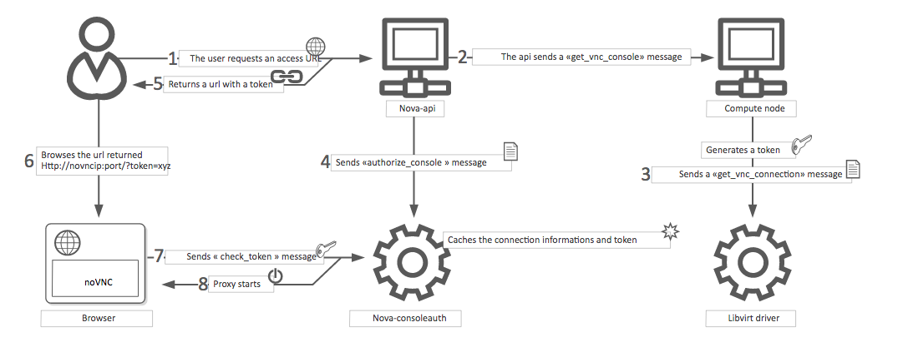
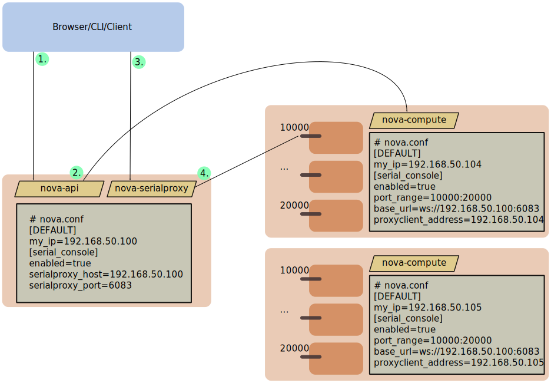

===============================
Configure remote console access
===============================

To provide a remote console or remote desktop access to guest virtual machines,
use VNC, SPICE HTML5 or Serial through either the OpenStack dashboard or the
command line. Best practice is to select only one of them to run.

.. _about-nova-consoleauth:

About nova-consoleauth
----------------------

The client proxies leverage a shared service to manage token authentication
called ``nova-consoleauth``. This service must be running for either proxy to
work. Many proxies of either type can be run against a single
``nova-consoleauth`` service in a cluster configuration.

Do not confuse the ``nova-consoleauth`` shared service with ``nova-console``,
which is a XenAPI-specific service that most recent VNC proxy architectures do
not use.

.. deprecated:: 18.0.0

   ``nova-consoleauth`` is deprecated since 18.0.0 (Rocky) and will be removed
   in an upcoming release. See
   :oslo.config:option:`workarounds.enable_consoleauth` for details.

SPICE console
-------------

OpenStack Compute supports VNC consoles to guests. The VNC protocol is fairly
limited, lacking support for multiple monitors, bi-directional audio, reliable
cut-and-paste, video streaming and more. SPICE is a new protocol that aims to
address the limitations in VNC and provide good remote desktop support.

SPICE support in OpenStack Compute shares a similar architecture to the VNC
implementation. The OpenStack dashboard uses a SPICE-HTML5 widget in its
console tab that communicates to the ``nova-spicehtml5proxy`` service by using
SPICE-over-websockets. The ``nova-spicehtml5proxy`` service communicates
directly with the hypervisor process by using SPICE.

VNC must be explicitly disabled to get access to the SPICE console. Set the
``vnc_enabled`` option to ``False`` in the ``[DEFAULT]`` section to disable the
VNC console.

Use the following options to configure SPICE as the console for OpenStack
Compute:

.. code-block:: console

   [spice]
   agent_enabled = False
   enabled = True
   html5proxy_base_url = http://IP_ADDRESS:6082/spice_auto.html
   html5proxy_host = 0.0.0.0
   html5proxy_port = 6082
   keymap = en-us
   server_listen = 127.0.0.1
   server_proxyclient_address = 127.0.0.1

Replace ``IP_ADDRESS`` with the management interface IP address of the
controller or the VIP.

VNC console proxy
-----------------

The VNC proxy is an OpenStack component that enables compute service users to
access their instances through VNC clients.

.. note::

   The web proxy console URLs do not support the websocket protocol scheme
   (ws://) on python versions less than 2.7.4.

The VNC console connection works as follows:

#. A user connects to the API and gets an ``access_url`` such as,
   ``http://ip:port/?token=xyz``.

#. The user pastes the URL in a browser or uses it as a client parameter.

#. The browser or client connects to the proxy.

#. The proxy talks to ``nova-consoleauth`` to authorize the token for the user,
   and maps the token to the *private* host and port of the VNC server for an
   instance.

   The compute host specifies the address that the proxy should use to connect
   through the ``nova.conf`` file option, ``server_proxyclient_address``. In
   this way, the VNC proxy works as a bridge between the public network and
   private host network.

#. The proxy initiates the connection to VNC server and continues to proxy
   until the session ends.

The proxy also tunnels the VNC protocol over WebSockets so that the ``noVNC``
client can talk to VNC servers. In general, the VNC proxy:

- Bridges between the public network where the clients live and the private
  network where VNC servers live.

- Mediates token authentication.

- Transparently deals with hypervisor-specific connection details to provide a
  uniform client experience.

VNC proxy security
~~~~~~~~~~~~~~~~~~

Deploy the public-facing interface of the VNC proxy with HTTPS to prevent
attacks from malicious parties on the network between the tenant user and proxy
server. When using HTTPS, the TLS encryption only applies to data between the
tenant user and proxy server. The data between the proxy server and Compute
node instance will still be unencrypted. To provide protection for the latter,
it is necessary to enable the VeNCrypt authentication scheme for VNC in both
the Compute nodes and noVNC proxy server hosts.

QEMU/KVM Compute node configuration
+++++++++++++++++++++++++++++++++++

Ensure each Compute node running QEMU/KVM with libvirt has a set of
certificates issued to it. The following is a list of the required
certificates:

- :file:`/etc/pki/libvirt-vnc/server-cert.pem`

  An x509 certificate to be presented **by the VNC server**. The ``CommonName``
  should match the **primary hostname of the compute node**. Use of
  ``subjectAltName`` is also permitted if there is a need to use multiple
  hostnames or IP addresses to access the same Compute node.

- :file:`/etc/pki/libvirt-vnc/server-key.pem`

  The private key used to generate the ``server-cert.pem`` file.

- :file:`/etc/pki/libvirt-vnc/ca-cert.pem`

  The authority certificate used to sign ``server-cert.pem`` and sign the VNC
  proxy server certificates.

The certificates must have v3 basic constraints [3]_ present to indicate the
permitted key use and purpose data.

We recommend using a dedicated certificate authority solely for the VNC
service. This authority may be a child of the master certificate authority used
for the OpenStack deployment. This is because libvirt does not currently have
a mechanism to restrict what certificates can be presented by the proxy server.

For further details on certificate creation, consult the QEMU manual page
documentation on VNC server certificate setup [2]_.

Configure libvirt to enable the VeNCrypt authentication scheme for the VNC
server. In :file:`/etc/libvirt/qemu.conf`, uncomment the following settings:

- ``vnc_tls=1``

  This instructs libvirt to enable the VeNCrypt authentication scheme when
  launching QEMU, passing it the certificates shown above.

- ``vnc_tls_x509_verify=1``

  This instructs QEMU to require that all VNC clients present a valid x509
  certificate. Assuming a dedicated certificate authority is used for the VNC
  service, this ensures that only approved VNC proxy servers can connect to the
  Compute nodes.

After editing :file:`qemu.conf`, the ``libvirtd`` service must be restarted:

.. code:: shell

  $ systemctl restart libvirtd.service

Changes will not apply to any existing running guests on the Compute node, so
this configuration should be done before launching any instances.

noVNC proxy server configuration
++++++++++++++++++++++++++++++++

The noVNC proxy server initially only supports the ``none`` authentication
scheme, which does no checking. Therefore, it is necessary to enable the
``vencrypt`` authentication scheme by editing the :file:`nova.conf` file to
set.

.. code::

  [vnc]
  auth_schemes=vencrypt,none

The :oslo.config:option:`vnc.auth_schemes` values should be listed in order
of preference. If enabling VeNCrypt on an existing deployment which already has
instances running, the noVNC proxy server must initially be allowed to use
``vencrypt`` and ``none``. Once it is confirmed that all Compute nodes have
VeNCrypt enabled for VNC, it is possible to remove the ``none`` option from the
list of the :oslo.config:option:`vnc.auth_schemes` values.

At that point, the noVNC proxy will refuse to connect to any Compute node that
does not offer VeNCrypt.

As well as enabling the authentication scheme, it is necessary to provide
certificates to the noVNC proxy.

- :file:`/etc/pki/nova-novncproxy/client-cert.pem`

  An x509 certificate to be presented **to the VNC server**. While libvirt/QEMU
  will not currently do any validation of the ``CommonName`` field, future
  versions will allow for setting up access controls based on the
  ``CommonName``. The ``CommonName`` field should match the **primary hostname
  of the controller node**. If using a HA deployment, the ``Organization``
  field can also be configured to a value that is common across all console
  proxy instances in the deployment. This avoids the need to modify each
  compute node's whitelist every time a console proxy instance is added or
  removed.

- :file:`/etc/pki/nova-novncproxy/client-key.pem`

  The private key used to generate the ``client-cert.pem`` file.

- :file:`/etc/pki/nova-novncproxy/ca-cert.pem`

  The certificate authority cert used to sign ``client-cert.pem`` and sign the
  compute node VNC server certificates.

The certificates must have v3 basic constraints [3]_ present to indicate the
permitted key use and purpose data.

Once the certificates have been created, the noVNC console proxy service must
be told where to find them. This requires editing :file:`nova.conf` to set.

.. code::

  [vnc]
  vencrypt_client_key=/etc/pki/nova-novncproxy/client-key.pem
  vencrypt_client_cert=/etc/pki/nova-novncproxy/client-cert.pem
  vencrypt_ca_certs=/etc/pki/nova-novncproxy/ca-cert.pem

VNC configuration options
~~~~~~~~~~~~~~~~~~~~~~~~~

To customize the VNC console, use the following configuration options in your
``nova.conf`` file:

.. note::

   To support :ref:`live migration <section_configuring-compute-migrations>`,
   you cannot specify a specific IP address for ``server_listen``, because
   that IP address does not exist on the destination host.

.. list-table:: **Description of VNC configuration options**
   :header-rows: 1
   :widths: 25 25

   * - Configuration option = Default value
     - Description
   * - **[DEFAULT]**
     -
   * - ``daemon = False``
     - (BoolOpt) Become a daemon (background process)
   * - ``key = None``
     - (StrOpt) SSL key file (if separate from cert)
   * - ``novncproxy_host = 0.0.0.0``
     - (StrOpt) Host on which to listen for incoming requests
   * - ``novncproxy_port = 6080``
     - (IntOpt) Port on which to listen for incoming requests
   * - ``record = False``
     - (BoolOpt) Record sessions to FILE.[session_number]
   * - ``source_is_ipv6 = False``
     - (BoolOpt) Source is ipv6
   * - ``ssl_only = False``
     - (BoolOpt) Disallow non-encrypted connections
   * - ``web = /usr/share/spice-html5``
     - (StrOpt) Run webserver on same port. Serve files from DIR.
   * - **[vmware]**
     -
   * - ``vnc_port = 5900``
     - (IntOpt) VNC starting port
   * - ``vnc_port_total = 10000``
     - vnc_port_total = 10000
   * - **[vnc]**
     -
   * - enabled = True
     - (BoolOpt) Enable VNC related features
   * - novncproxy_base_url = http://127.0.0.1:6080/vnc_auto.html
     - (StrOpt) Location of VNC console proxy, in the form
       "http://127.0.0.1:6080/vnc_auto.html"
   * - server_listen = 127.0.0.1
     - (StrOpt) IP address on which instance vncservers should listen
   * - server_proxyclient_address = 127.0.0.1
     - (StrOpt) The address to which proxy clients (like nova-xvpvncproxy)
       should connect
   * - xvpvncproxy_base_url = http://127.0.0.1:6081/console
     - (StrOpt) Location of nova xvp VNC console proxy, in the form
       "http://127.0.0.1:6081/console"

.. note::

   - The ``server_proxyclient_address`` defaults to ``127.0.0.1``, which is
     the address of the compute host that Compute instructs proxies to use when
     connecting to instance servers.

   - For all-in-one XenServer domU deployments, set this to ``169.254.0.1.``

   - For multi-host XenServer domU deployments, set to a ``dom0 management IP``
     on the same network as the proxies.

   - For multi-host libvirt deployments, set to a host management IP on the
     same network as the proxies.

Typical deployment
~~~~~~~~~~~~~~~~~~

A typical deployment has the following components:

- A ``nova-consoleauth`` process. Typically runs on the controller host.

- One or more ``nova-novncproxy`` services. Supports browser-based noVNC
  clients. For simple deployments, this service typically runs on the same
  machine as ``nova-api`` because it operates as a proxy between the public
  network and the private compute host network.

- One or more ``nova-xvpvncproxy`` services. Supports the special Java client
  discussed here. For simple deployments, this service typically runs on the
  same machine as ``nova-api`` because it acts as a proxy between the public
  network and the private compute host network.

- One or more compute hosts. These compute hosts must have correctly configured
  options, as follows.

nova-novncproxy (noVNC)
~~~~~~~~~~~~~~~~~~~~~~~

You must install the noVNC package, which contains the ``nova-novncproxy``
service. As root, run the following command:

.. code-block:: console

   # apt-get install nova-novncproxy

.. note::

  It has `been reported`_ that versions of noVNC older than 0.6 do not work
  with the ``nova-novncproxy`` service.

  If using non-US key mappings, then you need at least noVNC 1.0.0 for `a fix
  <https://github.com/novnc/noVNC/commit/99feba6ba8fee5b3a2b2dc99dc25e9179c560d31>`_.

.. _been reported: https://bugs.launchpad.net/nova/+bug/1752896

The service starts automatically on installation.

To restart the service, run:

.. code-block:: console

   # service nova-novncproxy restart

The configuration option parameter should point to your ``nova.conf`` file,
which includes the message queue server address and credentials.

By default, ``nova-novncproxy`` binds on ``0.0.0.0:6080``.

To connect the service to your Compute deployment, add the following
configuration options to your ``nova.conf`` file:

- ``server_listen=0.0.0.0``

  Specifies the address on which the VNC service should bind. Make sure it is
  assigned one of the compute node interfaces. This address is the one used by
  your domain file.

  .. code-block:: console

     <graphics type="vnc" autoport="yes" keymap="en-us" listen="0.0.0.0"/>

  .. note::

     To use live migration, use the 0.0.0.0 address.

- ``server_proxyclient_address=127.0.0.1``

  The address of the compute host that Compute instructs proxies to use when
  connecting to instance ``vncservers``.

Frequently asked questions about VNC access to virtual machines
~~~~~~~~~~~~~~~~~~~~~~~~~~~~~~~~~~~~~~~~~~~~~~~~~~~~~~~~~~~~~~~

- **Q: What is the difference between ``nova-xvpvncproxy`` and
  ``nova-novncproxy``?**

  A: ``nova-xvpvncproxy``, which ships with OpenStack Compute, is a proxy that
  supports a simple Java client. nova-novncproxy uses noVNC to provide VNC
  support through a web browser.

- **Q: I want VNC support in the OpenStack dashboard. What services do I
  need?**

  A: You need ``nova-novncproxy``, ``nova-consoleauth``, and correctly
  configured compute hosts.

- **Q: When I use ``nova get-vnc-console`` or click on the VNC tab of the
  OpenStack dashboard, it hangs. Why?**

  A: Make sure you are running ``nova-consoleauth`` (in addition to
  ``nova-novncproxy``). The proxies rely on ``nova-consoleauth`` to validate
  tokens, and waits for a reply from them until a timeout is reached.

- **Q: My VNC proxy worked fine during my all-in-one test, but now it doesn't
  work on multi host. Why?**

  A: The default options work for an all-in-one install, but changes must be
  made on your compute hosts once you start to build a cluster.  As an example,
  suppose you have two servers:

  .. code-block:: bash

     PROXYSERVER (public_ip=172.24.1.1, management_ip=192.168.1.1)
     COMPUTESERVER (management_ip=192.168.1.2)

  Your ``nova-compute`` configuration file must set the following values:

  .. code-block:: console

     [vnc]
     # These flags help construct a connection data structure
     server_proxyclient_address=192.168.1.2
     novncproxy_base_url=http://172.24.1.1:6080/vnc_auto.html
     xvpvncproxy_base_url=http://172.24.1.1:6081/console

     # This is the address where the underlying vncserver (not the proxy)
     # will listen for connections.
     server_listen=192.168.1.2

  .. note::

     ``novncproxy_base_url`` and ``xvpvncproxy_base_url`` use a public IP; this
     is the URL that is ultimately returned to clients, which generally do not
     have access to your private network. Your PROXYSERVER must be able to
     reach ``server_proxyclient_address``, because that is the address over
     which the VNC connection is proxied.

- **Q: My noVNC does not work with recent versions of web browsers. Why?**

  A: Make sure you have installed ``python-numpy``, which is required to
  support a newer version of the WebSocket protocol (HyBi-07+).

- **Q: How do I adjust the dimensions of the VNC window image in the OpenStack
  dashboard?**

  A: These values are hard-coded in a Django HTML template. To alter them, edit
  the ``_detail_vnc.html`` template file. The location of this file varies
  based on Linux distribution. On Ubuntu 14.04, the file is at
  ``/usr/share/pyshared/horizon/dashboards/nova/instances/templates/instances/_detail_vnc.html``.

  Modify the ``width`` and ``height`` options, as follows:

  .. code-block:: console

     <iframe src="{{ vnc_url }}" width="720" height="430"></iframe>

- **Q: My noVNC connections failed with ValidationError: Origin header protocol
  does not match. Why?**

  A: Make sure the ``base_url`` match your TLS setting. If you are using https
  console connections, make sure that the value of ``novncproxy_base_url`` is
  set explicitly where the ``nova-novncproxy`` service is running.

Serial Console
--------------

The *serial console* feature  [1]_ in nova is an alternative for graphical
consoles like *VNC*, *SPICE*, *RDP*. The example below uses these nodes:

* controller node with IP ``192.168.50.100``
* compute node 1 with IP ``192.168.50.104``
* compute node 2 with IP ``192.168.50.105``

Here's the general flow of actions:

1. The user requests a serial console connection string for an instance
   from the REST API.
2. The `nova-api` service asks the `nova-compute` service, which manages
   that instance, to fulfill that request.
3. That connection string gets used by the user to connect to the
   `nova-serialproxy` service.
4. The `nova-serialproxy` service then proxies the console interaction
   to the port of the compute node where the instance is running. That
   port gets forwarded by the hypervisor into the KVM guest.

The config options for those nodes, which are in the section
``[serial_console]`` of your ``nova.conf``, are not intuitive at first.
Keep these things in mind:

* The ``serialproxy_host`` is the address the `nova-serialproxy` service
  listens to for incoming connections (see step 3).
* The ``serialproxy_port`` value must be the very same as in the URI
  of ``base_url``.
* The ``base_url`` on the compute node will be part of the response the user
  will get when asking for a serial console connection string (see step 1
  from above). This means it needs to be an URL the user can connect to.
* The ``proxyclient_address`` on the compute node will be used by the
  `nova-serialproxy` service to determine where to connect to for
  proxying the console interaction.

References
----------

.. [1] https://specs.openstack.org/openstack/nova-specs/specs/juno/implemented/serial-ports.html
.. [2] https://qemu.weilnetz.de/doc/qemu-doc.html#vnc_005fsec_005fcertificate_005fverify
.. [3] https://tools.ietf.org/html/rfc3280#section-4.2.1.10
