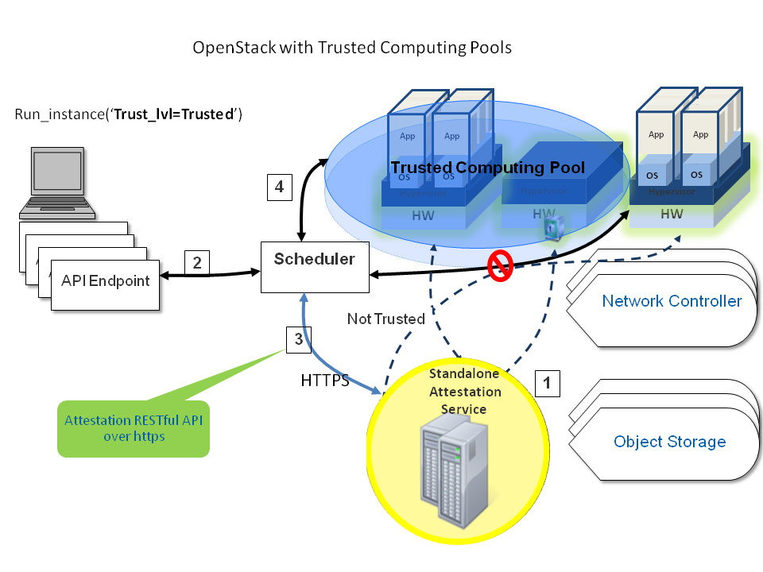
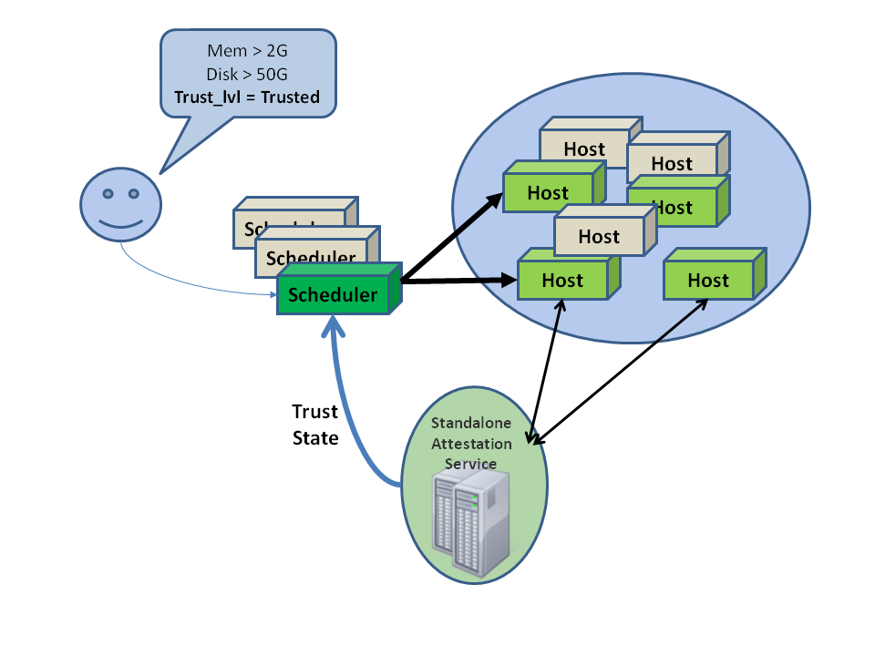

==================
Security hardening
==================

OpenStack Compute can be integrated with various third-party technologies to
increase security. For more information, see the `OpenStack Security Guide
<https://docs.openstack.org/security-guide/>`_.

Trusted compute pools
~~~~~~~~~~~~~~~~~~~~~

.. note:: The ``TrustedFilter`` was deprecated in the 16.0.0 Pike release and
  will be removed in the 17.0.0 Queens release.

Administrators can designate a group of compute hosts as trusted using trusted
compute pools. The trusted hosts use hardware-based security features, such as
the Intel Trusted Execution Technology (TXT), to provide an additional level of
security. Combined with an external stand-alone, web-based remote attestation
server, cloud providers can ensure that the compute node runs only software
with verified measurements and can ensure a secure cloud stack.

Trusted compute pools provide the ability for cloud subscribers to request
services run only on verified compute nodes.

The remote attestation server performs node verification like this:

1. Compute nodes boot with Intel TXT technology enabled.

2. The compute node BIOS, hypervisor, and operating system are measured.

3. When the attestation server challenges the compute node, the measured data
   is sent to the attestation server.

4. The attestation server verifies the measurements against a known good
   database to determine node trustworthiness.

A description of how to set up an attestation service is beyond the scope of
this document. For an open source project that you can use to implement an
attestation service, see the `Open Attestation
<https://github.com/OpenAttestation/OpenAttestation>`__ project.

   **Configuring Compute to use trusted compute pools**

#. Enable scheduling support for trusted compute pools by adding these lines to
   the ``DEFAULT`` section of the ``/etc/nova/nova.conf`` file:

   .. code-block:: ini

      [DEFAULT]
      compute_scheduler_driver=nova.scheduler.filter_scheduler.FilterScheduler
      scheduler_available_filters=nova.scheduler.filters.all_filters
      scheduler_default_filters=AvailabilityZoneFilter,RamFilter,ComputeFilter,TrustedFilter

#. Specify the connection information for your attestation service by adding
   these lines to the ``trusted_computing`` section of the
   ``/etc/nova/nova.conf`` file:

   .. code-block:: ini

      [trusted_computing]
      attestation_server = 10.1.71.206
      attestation_port = 8443
      # If using OAT v2.0 after, use this port:
      # attestation_port = 8181
      attestation_server_ca_file = /etc/nova/ssl.10.1.71.206.crt
      # If using OAT v1.5, use this api_url:
      attestation_api_url = /AttestationService/resources
      # If using OAT pre-v1.5, use this api_url:
      # attestation_api_url = /OpenAttestationWebServices/V1.0
      attestation_auth_blob = i-am-openstack

   In this example:

   ``server``
     Host name or IP address of the host that runs the attestation service

   ``port``
     HTTPS port for the attestation service

   ``server_ca_file``
     Certificate file used to verify the attestation server's identity

   ``api_url``
     The attestation service's URL path

   ``auth_blob``
     An authentication blob, required by the attestation service.

#. Save the file, and restart the ``nova-compute`` and ``nova-scheduler``
   service to pick up the changes.

To customize the trusted compute pools, use these configuration option
settings:

.. list-table:: **Description of trusted computing configuration options**
   :header-rows: 2

   * - Configuration option = Default value
     - Description
   * - [trusted_computing]
     -
   * - attestation_api_url = /OpenAttestationWebServices/V1.0
     - (StrOpt) Attestation web API URL
   * - attestation_auth_blob = None
     - (StrOpt) Attestation authorization blob - must change
   * - attestation_auth_timeout = 60
     - (IntOpt) Attestation status cache valid period length
   * - attestation_insecure_ssl = False
     - (BoolOpt) Disable SSL cert verification for Attestation service
   * - attestation_port = 8443
     - (StrOpt) Attestation server port
   * - attestation_server = None
     - (StrOpt) Attestation server HTTP
   * - attestation_server_ca_file = None
     - (StrOpt) Attestation server Cert file for Identity verification

**Specifying trusted flavors**

#. Flavors can be designated as trusted using the :command:`openstack flavor
   set` command. In this example, the ``m1.tiny`` flavor is being set as
   trusted:

   .. code-block:: console

      $ openstack flavor set --property trusted_host=trusted m1.tiny

#. You can request that your instance is run on a trusted host by specifying a
   trusted flavor when booting the instance:

   .. code-block:: console

      $ openstack server create --flavor m1.tiny \
        --key-name myKeypairName --image myImageID newInstanceName

Encrypt Compute metadata traffic
~~~~~~~~~~~~~~~~~~~~~~~~~~~~~~~~

**Enabling SSL encryption**

OpenStack supports encrypting Compute metadata traffic with HTTPS.  Enable SSL
encryption in the ``metadata_agent.ini`` file.

#. Enable the HTTPS protocol.

   .. code-block:: ini

      nova_metadata_protocol = https

#. Determine whether insecure SSL connections are accepted for Compute metadata
   server requests. The default value is ``False``.

   .. code-block:: ini

      nova_metadata_insecure = False

#. Specify the path to the client certificate.

   .. code-block:: ini

      nova_client_cert = PATH_TO_CERT

#. Specify the path to the private key.

   .. code-block:: ini

      nova_client_priv_key = PATH_TO_KEY
