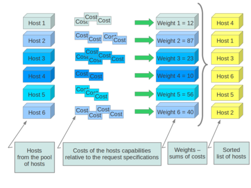

Filter Scheduler
================

The **Filter Scheduler** supports `filtering` and `weighting` to make informed
decisions on where a new instance should be created. This Scheduler supports
only working with Compute Nodes.

Filtering
---------

.. image:: ../images/filteringWorkflow1.png

During its work Filter Scheduler firstly makes dictionary of unfiltered hosts,
then filters them using filter properties and finally chooses hosts for the
requested number of instances (each time it chooses the most weighed host and
appends it to the list of selected hosts).

If it turns up, that it can't find candidates for the next instance, it means
that there are no more appropriate hosts where the instance could be scheduled.

If we speak about `filtering` and `weighting`, their work is quite flexible
in the Filter Scheduler. There are a lot of filtering strategies for the
Scheduler to support. Also you can even implement `your own algorithm of
filtering`.

There are some standard filter classes to use (:mod:`nova.scheduler.filters`):

* |AllHostsFilter| - frankly speaking, this filter does no operation. It
  passes all the available hosts.
* |ImagePropertiesFilter| - filters hosts based on properties defined
  on the instance's image.  It passes hosts that can support the specified
  image properties contained in the instance.
* |AvailabilityZoneFilter| - filters hosts by availability zone. It passes
  hosts matching the availability zone specified in the instance properties.
* |ComputeCapabilitiesFilter| - checks that the capabilities provided by the
  host compute service satisfy any extra specifications associated with the
  instance type.  It passes hosts that can create the specified instance type.

  The extra specifications can have a scope at the beginning of the key string
  of a key/value pair. The scope format is ``scope:key`` and can be nested,
  i.e. ``key_string := scope:key_string``. Example like ``capabilities:cpu_info:
  features`` is valid scope format. A key string without any ``:`` is non-scope
  format. Each filter defines it's valid scope, and not all filters accept
  non-scope format.

  The extra specifications can have an operator at the beginning of the value
  string of a key/value pair. If there is no operator specified, then a
  default operator of ``s==`` is used. Valid operators are:

::

  * = (equal to or greater than as a number; same as vcpus case)
  * == (equal to as a number)
  * != (not equal to as a number)
  * >= (greater than or equal to as a number)
  * <= (less than or equal to as a number)
  * s== (equal to as a string)
  * s!= (not equal to as a string)
  * s>= (greater than or equal to as a string)
  * s> (greater than as a string)
  * s<= (less than or equal to as a string)
  * s< (less than as a string)
  * <in> (substring)
  * <or> (find one of these)

  Examples are: ">= 5", "s== 2.1.0", "<in> gcc", and "<or> fpu <or> gpu"

* |AggregateInstanceExtraSpecsFilter| - checks that the aggregate metadata
  satisfies any extra specifications associated with the instance type (that
  have no scope or are scoped with ``aggregate_instance_extra_specs``).
  It passes hosts that can create the specified instance type.
  The extra specifications can have the same operators as
  |ComputeCapabilitiesFilter|.
* |ComputeFilter| - passes all hosts that are operational and enabled.
* |CoreFilter| - filters based on CPU core utilization. It passes hosts with
  sufficient number of CPU cores.
* |AggregateCoreFilter| - filters hosts by CPU core number with per-aggregate
  ``cpu_allocation_ratio`` setting. If no per-aggregate value is found, it will
  fall back to the global default ``cpu_allocation_ratio``. If more than one value
  is found for a host (meaning the host is in two different aggregate with
  different ratio settings), the minimum value will be used.
* |IsolatedHostsFilter| - filter based on ``image_isolated``, ``host_isolated``
  and ``restrict_isolated_hosts_to_isolated_images`` flags.
* |JsonFilter| - allows simple JSON-based grammar for selecting hosts.
* |RamFilter| - filters hosts by their RAM. Only hosts with sufficient RAM
  to host the instance are passed.
* |AggregateRamFilter| - filters hosts by RAM with per-aggregate
  ``ram_allocation_ratio`` setting. If no per-aggregate value is found, it will
  fall back to the global default ``ram_allocation_ratio``. If more than one value
  is found for a host (meaning the host is in two different aggregate with
  different ratio settings), the minimum value will be used.
* |DiskFilter| - filters hosts by their disk allocation. Only hosts with sufficient
  disk space to host the instance are passed.
  ``disk_allocation_ratio`` setting. It's virtual disk to physical disk
  allocation ratio and it's 1.0 by default. The total allow allocated disk size will
  be physical disk multiplied this ratio.
* |AggregateDiskFilter| - filters hosts by disk allocation with per-aggregate
  ``disk_allocation_ratio`` setting. If no per-aggregate value is found, it will
  fall back to the global default ``disk_allocation_ratio``. If more than one value
  is found for a host (meaning the host is in two or more different aggregates with
  different ratio settings), the minimum value will be used.
* |NumInstancesFilter| - filters hosts by number of running instances on it.
  hosts with too many instances will be filtered.
  ``max_instances_per_host`` setting. Maximum number of instances allowed to run on
  this host, the host will be ignored by scheduler if more than ``max_instances_per_host``
  are already existing on the host.
* |AggregateNumInstancesFilter| - filters hosts by number of instances with
  per-aggregate ``max_instances_per_host`` setting. If no per-aggregate value
  is found, it will fall back to the global default ``max_instances_per_host``.
  If more than one value is found for a host (meaning the host is in two or more
  different aggregates with different max instances per host settings),
  the minimum value will be used.
* |IoOpsFilter| - filters hosts by concurrent I/O operations on it.
  hosts with too many concurrent I/O operations will be filtered.
  ``max_io_ops_per_host`` setting. Maximum number of I/O intensive instances allowed to
  run on this host, the host will be ignored by scheduler if more than ``max_io_ops_per_host``
  instances such as build/resize/snapshot etc are running on it.
* |AggregateIoOpsFilter| - filters hosts by I/O operations with per-aggregate
  ``max_io_ops_per_host`` setting. If no per-aggregate value is found, it will
  fall back to the global default ``max_io_ops_per_host``. If more than
  one value is found for a host (meaning the host is in two or more different
  aggregates with different max io operations settings), the minimum value
  will be used.
* |PciPassthroughFilter| - Filter that schedules instances on a host if the host
  has devices to meet the device requests in the 'extra_specs' for the flavor.
* |SimpleCIDRAffinityFilter| - allows to put a new instance on a host within
  the same IP block.
* |DifferentHostFilter| - allows to put the instance on a different host from a
  set of instances.
* |SameHostFilter| - puts the instance on the same host as another instance in
  a set of instances.
* |RetryFilter| - filters hosts that have been attempted for scheduling.
  Only passes hosts that have not been previously attempted.
* |TrustedFilter| - filters hosts based on their trust.  Only passes hosts
  that meet the trust requirements specified in the instance properties.
* |TypeAffinityFilter| - Only passes hosts that are not already running an
  instance of the requested type.
* |AggregateTypeAffinityFilter| - limits instance_type by aggregate.
* |ServerGroupAntiAffinityFilter| - This filter implements anti-affinity for a
  server group.  First you must create a server group with a policy of
  'anti-affinity' via the server groups API.  Then, when you boot a new server,
  provide a scheduler hint of 'group=<uuid>' where <uuid> is the UUID of the
  server group you created.  This will result in the server getting added to the
  group.  When the server gets scheduled, anti-affinity will be enforced among
  all servers in that group.
* |ServerGroupAffinityFilter| - This filter works the same way as
  ServerGroupAntiAffinityFilter.  The difference is that when you create the server
  group, you should specify a policy of 'affinity'.
* |AggregateMultiTenancyIsolation| - isolate tenants in specific aggregates.
* |AggregateImagePropertiesIsolation| - isolates hosts based on image
  properties and aggregate metadata.
* |MetricsFilter| - filters hosts based on metrics weight_setting. Only hosts with
  the available metrics are passed.
* |NUMATopologyFilter| - filters hosts based on the NUMA topology requested by the
  instance, if any.

Now we can focus on these standard filter classes in details. I will pass the
simplest ones, such as |AllHostsFilter|, |CoreFilter| and |RamFilter| are,
because their functionality is quite simple and can be understood just from the
code. For example class |RamFilter| has the next realization:

::

    class RamFilter(filters.BaseHostFilter):
        """Ram Filter with over subscription flag"""

        def host_passes(self, host_state, filter_properties):
            """Only return hosts with sufficient available RAM."""
            instance_type = filter_properties.get('instance_type')
            requested_ram = instance_type['memory_mb']
            free_ram_mb = host_state.free_ram_mb
            total_usable_ram_mb = host_state.total_usable_ram_mb
            used_ram_mb = total_usable_ram_mb - free_ram_mb
            return total_usable_ram_mb * FLAGS.ram_allocation_ratio  - used_ram_mb >= requested_ram

Here ``ram_allocation_ratio`` means the virtual RAM to physical RAM allocation
ratio (it is ``1.5`` by default). Really, nice and simple.

Next standard filter to describe is |AvailabilityZoneFilter| and it isn't
difficult too. This filter just looks at the availability zone of compute node
and availability zone from the properties of the request. Each compute service
has its own availability zone. So deployment engineers have an option to run
scheduler with availability zones support and can configure availability zones
on each compute host. This classes method ``host_passes`` returns ``True`` if
availability zone mentioned in request is the same on the current compute host.

The |ImagePropertiesFilter| filters hosts based on the architecture,
hypervisor type, and virtual machine mode specified in the
instance.  E.g., an instance might require a host that supports the arm
architecture on a qemu compute host.  The |ImagePropertiesFilter| will only
pass hosts that can satisfy this request.  These instance
properties are populated from properties define on the instance's image.
E.g. an image can be decorated with these properties using
``glance image-update img-uuid --property architecture=arm --property
hypervisor_type=qemu``
Only hosts that satisfy these requirements will pass the
|ImagePropertiesFilter|.

|ComputeCapabilitiesFilter| checks if the host satisfies any ``extra_specs``
specified on the instance type.  The ``extra_specs`` can contain key/value pairs.
The key for the filter is either non-scope format (i.e. no ``:`` contained), or
scope format in capabilities scope (i.e. ``capabilities:xxx:yyy``). One example
of capabilities scope is ``capabilities:cpu_info:features``, which will match
host's cpu features capabilities. The |ComputeCapabilitiesFilter| will only
pass hosts whose capabilities satisfy the requested specifications.  All hosts
are passed if no ``extra_specs`` are specified.

|ComputeFilter| is quite simple and passes any host whose compute service is
enabled and operational.

Now we are going to |IsolatedHostsFilter|. There can be some special hosts
reserved for specific images. These hosts are called **isolated**. So the
images to run on the isolated hosts are also called isolated. This Scheduler
checks if ``image_isolated`` flag named in instance specifications is the same
that the host has. Isolated hosts can run non isolated images if the flag
``restrict_isolated_hosts_to_isolated_images`` is set to false.

|DifferentHostFilter| - its method ``host_passes`` returns ``True`` if host to
place instance on is different from all the hosts used by set of instances.

|SameHostFilter| does the opposite to what |DifferentHostFilter| does. So its
``host_passes`` returns ``True`` if the host we want to place instance on is
one of the set of instances uses.

|SimpleCIDRAffinityFilter| looks at the subnet mask and investigates if
the network address of the current host is in the same sub network as it was
defined in the request.

|JsonFilter| - this filter provides the opportunity to write complicated
queries for the hosts capabilities filtering, based on simple JSON-like syntax.
There can be used the following operations for the host states properties:
``=``, ``<``, ``>``, ``in``, ``<=``, ``>=``, that can be combined with the following
logical operations: ``not``, ``or``, ``and``. For example, there is the query you can
find in tests:

::

    ['and',
        ['>=', '$free_ram_mb', 1024],
        ['>=', '$free_disk_mb', 200 * 1024]
    ]

This query will filter all hosts with free RAM greater or equal than 1024 MB
and at the same time with free disk space greater or equal than 200 GB.

Many filters use data from ``scheduler_hints``, that is defined in the moment of
creation of the new server for the user. The only exception for this rule is
|JsonFilter|, that takes data in some strange difficult to understand way.

The |RetryFilter| filters hosts that have already been attempted for scheduling.
It only passes hosts that have not been previously attempted.

The |TrustedFilter| filters hosts based on their trust.  Only passes hosts
that match the trust requested in the ``extra_specs`` for the flavor. The key
for this filter must be scope format as ``trust:trusted_host``, where ``trust``
is the scope of the key and ``trusted_host`` is the actual key value.
The value of this pair (``trusted``/``untrusted``) must match the
integrity of a host (obtained from the Attestation service) before it is
passed by the |TrustedFilter|.

The |NUMATopologyFilter| considers the NUMA topology that was specified for the instance
through the use of flavor extra_specs in combination with the image properties, as
described in detail in the related nova-spec document:

* http://git.openstack.org/cgit/openstack/nova-specs/tree/specs/juno/virt-driver-numa-placement.rst

and try to match it with the topology exposed by the host, accounting for the
``ram_allocation_ratio`` and ``cpu_allocation_ratio`` for over-subscription. The
filtering is done in the following manner:

* Filter will attempt to pack instance cells onto host cells.
* It will consider the standard over-subscription limits for each host NUMA cell,
  and provide limits to the compute host accordingly (as mentioned above).
* If instance has no topology defined, it will be considered for any host.
* If instance has a topology defined, it will be considered only for NUMA
  capable hosts.

To use filters you specify next two settings:

* ``scheduler_available_filters`` - Defines filter classes made available to the
   scheduler.  This setting can be used multiple times.
* ``scheduler_default_filters`` - Of the available filters, defines those that
  the scheduler uses by default.

The default values for these settings in nova.conf are:

::

    --scheduler_available_filters=nova.scheduler.filters.standard_filters
    --scheduler_default_filters=RamFilter,ComputeFilter,AvailabilityZoneFilter,ComputeCapabilitiesFilter,ImagePropertiesFilter,ServerGroupAntiAffinityFilter,ServerGroupAffinityFilter'

With this configuration, all filters in ``nova.scheduler.filters``
would be available, and by default the |RamFilter|, |ComputeFilter|,
|AvailabilityZoneFilter|, |ComputeCapabilitiesFilter|,
|ImagePropertiesFilter|, |ServerGroupAntiAffinityFilter|,
and |ServerGroupAffinityFilter| would be used.

If you want to create **your own filter** you just need to inherit from
|BaseHostFilter| and implement one method:
``host_passes``. This method should return ``True`` if host passes the filter. It
takes ``host_state`` (describes host) and ``filter_properties`` dictionary as the
parameters.

As an example, nova.conf could contain the following scheduler-related
settings:

::

    --scheduler_driver=nova.scheduler.FilterScheduler
    --scheduler_available_filters=nova.scheduler.filters.standard_filters
    --scheduler_available_filters=myfilter.MyFilter
    --scheduler_default_filters=RamFilter,ComputeFilter,MyFilter

With these settings, nova will use the ``FilterScheduler`` for the scheduler
driver.  The standard nova filters and MyFilter are available to the
FilterScheduler.  The RamFilter, ComputeFilter, and MyFilter are used by
default when no filters are specified in the request.

Weights
-------

Filter Scheduler uses the so called **weights** during its work. A weigher is a
way to select the best suitable host from a group of valid hosts by giving
weights to all the hosts in the list.

In order to prioritize one weigher against another, all the weighers have to
define a multiplier that will be applied before computing the weight for a node.
All the weights are normalized beforehand so that the  multiplier can be applied
easily. Therefore the final weight for the object will be::

    weight = w1_multiplier * norm(w1) + w2_multiplier * norm(w2) + ...

A weigher should be a subclass of ``weights.BaseHostWeigher`` and they must
implement the ``weight_multiplier`` and ``weight_object`` methods. If the
``weight_objects`` method is overridden it just return a list of weights, and not
modify the weight of the object directly, since final weights are normalized and
computed by ``weight.BaseWeightHandler``.

The Filter Scheduler weighs hosts based on the config option
`scheduler_weight_classes`, this defaults to
`nova.scheduler.weights.all_weighers`, which selects the following weighers:

* |RAMWeigher| Hosts are then weighted and sorted with the largest weight winning.
  If the multiplier is negative, the host with less RAM available will win (useful
  for stacking hosts, instead of spreading).
* |MetricsWeigher| This weigher can compute the weight based on the compute node
  host's various metrics. The to-be weighed metrics and their weighing ratio
  are specified in the configuration file as the followings::

    metrics_weight_setting = name1=1.0, name2=-1.0

* |IoOpsWeigher| The weigher can compute the weight based on the compute node
  host's workload. The default is to preferably choose light workload compute
  hosts. If the multiplier is positive, the weigher prefer choosing heavy
  workload compute hosts, the weighing has the opposite effect of the default.

Filter Scheduler finds local list of acceptable hosts by repeated filtering and
weighing. Each time it chooses a host, it virtually consumes resources on it,
so subsequent selections can adjust accordingly. It is useful if the customer
asks for the some large amount of instances, because weight is computed for
each instance requested.

In the end Filter Scheduler sorts selected hosts by their weight and provisions
instances on them.

P.S.: you can find more examples of using Filter Scheduler and standard filters
in :mod:``nova.tests.scheduler``.

.. |AllHostsFilter| replace:: :class:`AllHostsFilter <nova.scheduler.filters.all_hosts_filter.AllHostsFilter>`
.. |ImagePropertiesFilter| replace:: :class:`ImagePropertiesFilter <nova.scheduler.filters.image_props_filter.ImagePropertiesFilter>`
.. |AvailabilityZoneFilter| replace:: :class:`AvailabilityZoneFilter <nova.scheduler.filters.availability_zone_filter.AvailabilityZoneFilter>`
.. |BaseHostFilter| replace:: :class:`BaseHostFilter <nova.scheduler.filters.BaseHostFilter>`
.. |ComputeCapabilitiesFilter| replace:: :class:`ComputeCapabilitiesFilter <nova.scheduler.filters.compute_capabilities_filter.ComputeCapabilitiesFilter>`
.. |ComputeFilter| replace:: :class:`ComputeFilter <nova.scheduler.filters.compute_filter.ComputeFilter>`
.. |CoreFilter| replace:: :class:`CoreFilter <nova.scheduler.filters.core_filter.CoreFilter>`
.. |AggregateCoreFilter| replace:: :class:`AggregateCoreFilter <nova.scheduler.filters.core_filter.AggregateCoreFilter>`
.. |IsolatedHostsFilter| replace:: :class:`IsolatedHostsFilter <nova.scheduler.filters.isolated_hosts_filter>`
.. |JsonFilter| replace:: :class:`JsonFilter <nova.scheduler.filters.json_filter.JsonFilter>`
.. |RamFilter| replace:: :class:`RamFilter <nova.scheduler.filters.ram_filter.RamFilter>`
.. |AggregateRamFilter| replace:: :class:`AggregateRamFilter <nova.scheduler.filters.ram_filter.AggregateRamFilter>`
.. |DiskFilter| replace:: :class:`DiskFilter <nova.scheduler.filters.disk_filter.DiskFilter>`
.. |AggregateDiskFilter| replace:: :class:`AggregateDiskFilter <nova.scheduler.filters.disk_filter.AggregateDiskFilter>`
.. |NumInstancesFilter| replace:: :class:`NumInstancesFilter <nova.scheduler.filters.num_instances_filter.NumInstancesFilter>`
.. |AggregateNumInstancesFilter| replace:: :class:`AggregateNumInstancesFilter <nova.scheduler.filters.num_instances_filter.AggregateNumInstancesFilter>`
.. |IoOpsFilter| replace:: :class:`IoOpsFilter <nova.scheduler.filters.io_ops_filter.IoOpsFilter>`
.. |AggregateIoOpsFilter| replace:: :class:`AggregateIoOpsFilter <nova.scheduler.filters.io_ops_filter.AggregateIoOpsFilter>`
.. |PciPassthroughFilter| replace:: :class:`PciPassthroughFilter <nova.scheduler.filters.pci_passthrough_filter.PciPassthroughFilter>`
.. |SimpleCIDRAffinityFilter| replace:: :class:`SimpleCIDRAffinityFilter <nova.scheduler.filters.affinity_filter.SimpleCIDRAffinityFilter>`
.. |DifferentHostFilter| replace:: :class:`DifferentHostFilter <nova.scheduler.filters.affinity_filter.DifferentHostFilter>`
.. |SameHostFilter| replace:: :class:`SameHostFilter <nova.scheduler.filters.affinity_filter.SameHostFilter>`
.. |RetryFilter| replace:: :class:`RetryFilter <nova.scheduler.filters.retry_filter.RetryFilter>`
.. |TrustedFilter| replace:: :class:`TrustedFilter <nova.scheduler.filters.trusted_filter.TrustedFilter>`
.. |TypeAffinityFilter| replace:: :class:`TypeAffinityFilter <nova.scheduler.filters.type_filter.TypeAffinityFilter>`
.. |AggregateTypeAffinityFilter| replace:: :class:`AggregateTypeAffinityFilter <nova.scheduler.filters.type_filter.AggregateTypeAffinityFilter>`
.. |ServerGroupAntiAffinityFilter| replace:: :class:`ServerGroupAntiAffinityFilter <nova.scheduler.filters.affinity_filter.ServerGroupAntiAffinityFilter>`
.. |ServerGroupAffinityFilter| replace:: :class:`ServerGroupAffinityFilter <nova.scheduler.filters.affinity_filter.ServerGroupAffinityFilter>`
.. |AggregateInstanceExtraSpecsFilter| replace:: :class:`AggregateInstanceExtraSpecsFilter <nova.scheduler.filters.aggregate_instance_extra_specs.AggregateInstanceExtraSpecsFilter>`
.. |AggregateMultiTenancyIsolation| replace:: :class:`AggregateMultiTenancyIsolation <nova.scheduler.filters.aggregate_multitenancy_isolation.AggregateMultiTenancyIsolation>`
.. |NUMATopologyFilter| replace:: :class:`NUMATopologyFilter <nova.scheduler.filters.numa_topology_filter.NUMATopologyFilter>`
.. |RAMWeigher| replace:: :class:`RAMWeigher <nova.scheduler.weights.ram.RAMWeigher>`
.. |AggregateImagePropertiesIsolation| replace:: :class:`AggregateImagePropertiesIsolation <nova.scheduler.filters.aggregate_image_properties_isolation.AggregateImagePropertiesIsolation>`
.. |MetricsFilter| replace:: :class:`MetricsFilter <nova.scheduler.filters.metrics_filter.MetricsFilter>`
.. |MetricsWeigher| replace:: :class:`MetricsWeigher <nova.scheduler.weights.metrics.MetricsWeigher>`
.. |IoOpsWeigher| replace:: :class:`IoOpsWeigher <nova.scheduler.weights.io_ops.IoOpsWeigher>`
