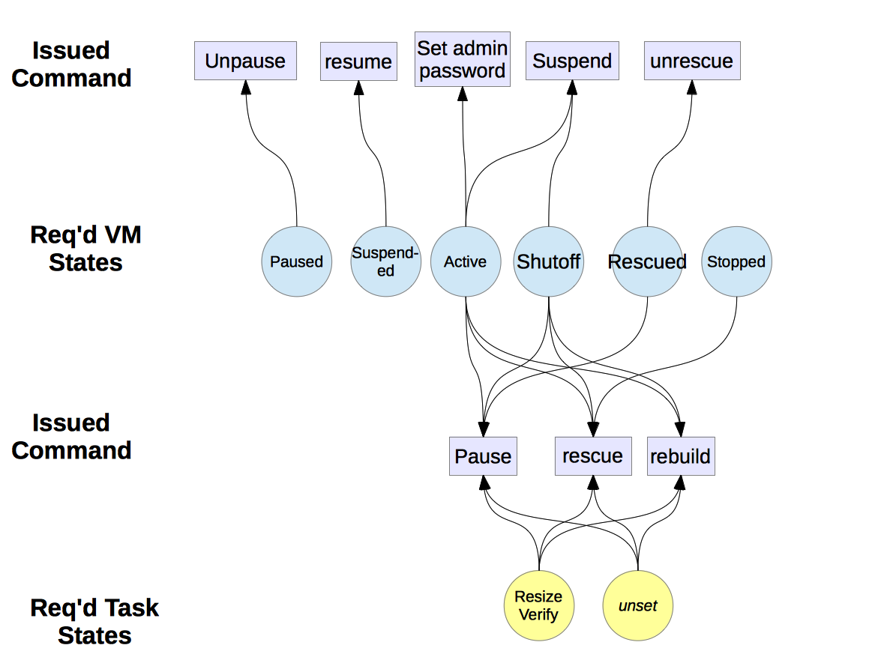
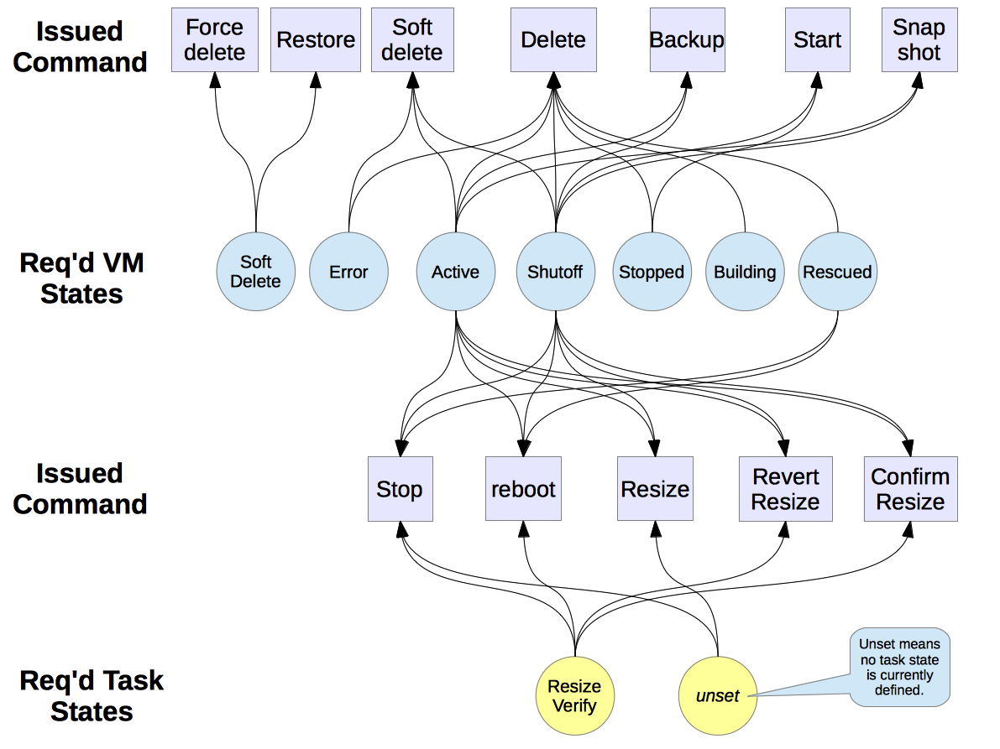
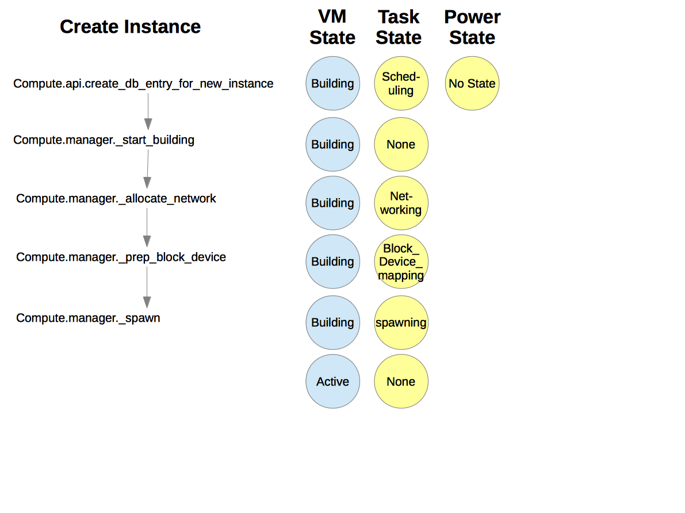

Virtual Machine States and Transitions
=======================================

Preconditions for commands
--------------------------

The following diagrams show the required virtual machine (VM) states and
task states for various commands issued by the user:

.. graphviz::

  digraph states {
    node [fontsize=10 fontname="Monospace"]
    /* states */
    building [label="BUILDING"]

    active [label="ACTIVE"]
    paused [label="PAUSED"]
    suspended [label="SUSPENDED"]
    stopped [label="STOPPED"]
    rescued [label="RESCUED"]
    resized [label="RESIZED"]
    soft_deleted [label="SOFT_DELETED"]
    deleted [label="DELETED"]
    error [label="ERROR"]
    shelved [label="SHELVED"]
    shelved_offloaded [label="SHELVED_OFFLOADED"]
        
    /* apis */
    create [shape="rectangle"]
    create -> active
    create -> error
    building -> create

    delete [shape="rectangle"]
    delete -> deleted
    building -> delete
    paused -> delete
    suspended -> delete
    stopped -> delete
    rescued -> delete
    soft_deleted -> delete
    error -> delete

    soft_delete [shape="rectangle"]
    soft_delete -> soft_deleted
    soft_delete -> error
    active -> soft_delete
    stopped -> soft_delete

    restore [shape="rectangle"]
    restore -> active
    restore -> error
    soft_deleted -> restore

    pause [shape="rectangle"]
    pause -> paused
    pause -> error
    active -> pause

    unpause [shape="rectangle"]
    unpause -> active
    unpause -> error
    paused -> unpause

    suspend [shape="rectangle"]
    suspend -> suspended
    suspend -> error
    active -> suspend

    resume [shape="rectangle"]
    resume -> active
    resume -> error
    suspended -> resume

    start [shape="rectangle"]
    start -> active
    start -> error
    stopped -> start

    stop [shape="rectangle"]
    stop -> stopped
    stop -> error
    active -> stop
    error -> stop

    rescue [shape="rectangle"]
    rescue -> rescued
    rescue -> error
    active -> rescue
    stopped -> rescue
    error -> rescue

    unrescue [shape="rectangle"]
    unrescue -> active
    rescued -> unrescue

    resize [shape="rectangle"]
    resize -> resized
    resize -> error
    active -> resize
    stopped -> resize

    confirm_resize [shape="rectangle"]
    confirm_resize -> active
    confirm_resize -> error
    resized -> confirm_resize
    confirm_resize [shape="rectangle"]

    revert_resize -> active
    revert_resize -> error
    resized -> revert_resize

    snapshot [shape="rectangle"]
    snapshot -> active
    snapshot -> stopped
    snapshot -> error
    active -> snapshot
    stopped -> snapshot

    backup [shape="rectangle"]
    backup -> active
    backup -> stopped
    backup -> error
    active -> backup
    stopped -> backup

    rebuild [shape="rectangle"]
    rebuild -> active
    rebuild -> error
    active -> rebuild
    stopped -> rebuild

    set_admin_password [shape="rectangle"]
    set_admin_password -> active
    set_admin_password -> error
    active -> set_admin_password

    reboot [shape="rectangle"]
    reboot -> active
    reboot -> error
    active -> reboot
    stopped -> reboot
    paused -> reboot
    suspended -> reboot
    error -> reboot

    live_migrate [shape="rectangle"]
    live_migrate -> active
    live_migrate -> error
    active -> live_migrate

    shelve [shape="rectangle"]
    shelve -> shelved
    shelve -> shelved_offloaded
    shelve -> error
    active -> shelve
    stopped -> shelve
    paused -> shelve
    suspended -> shelve

    shelve_offload [shape="rectangle"]
    shelve_offload -> shelved_offloaded
    shelve_offload -> error
    shelved -> shelve_offload

    unshelve [shape="rectangle"]
    unshelve -> active
    unshelve -> error
    shelved -> unshelve
    shelved_offloaded -> unshelve
  }

Create instance states
----------------------

The following diagram shows the sequence of VM states, task states, and
power states when a new VM instance is created.

